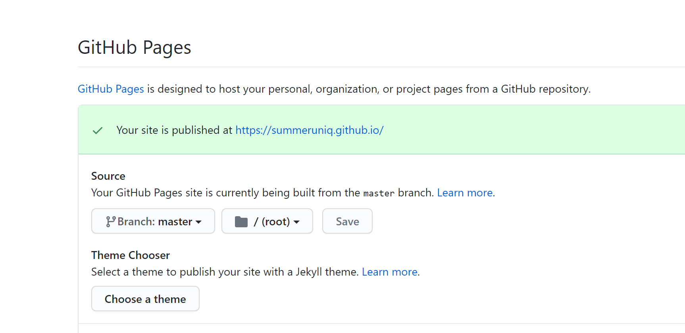

1- github 新建项目 

项目名： summerUniq.github.io   （summerUniq是你的github userName)

2- 查看项目settings， 找到GitHub Pages 你的博客地址就在这里



3- 本地创建项目文件夹(名字自定义），安装hexo

```javascript
mkdir myBlog
cd myBlog
npm install -g hexo
```

4- 检查安装 

```
hexo -v
```

5- 初始化文件夹(失败了清空文件夹，再试一次)

```
hexo init
npm install
hexo g // 项目打包
hexo s // 启动项目 通过地址就可以访问项目了， 如果页面一直访问不了，有可能端口占用， 可以通过 hexo server -p 端口号  修改端口号
```

- 项目目录介绍

```javascript
├── _config.yml // 网站的配置文件
├── package.json
├── scaffolds // 模板文件夹，当您新建文章时，Hexo 会根据 scaffold 来建立文件。Hexo的模板是指在新建的文章文件中默认填充的内容。例如，如果您修改scaffold/post.md中的Front-matter内容，那么每次新建一篇文章时都会包含这个修改。
├── source // 资源文件夹是存放用户资源的地方。除 _posts 文件夹之外，开头命名为 _ (下划线)的文件 / 文				件夹和隐藏的文件将会被忽略。Markdown 和 HTML 文件会被解析并放到 public 文件夹，而其他				文件会被拷贝过去。
|   ├── _drafts
|   └── _posts 
└── themes //主题 文件夹。Hexo 会根据主题来生成静态页面。
```

6- 将myBlog项目和github Page联系起来

```javascript
git init 
git config user.name "xxx"
git config user.email "xxx"
```

在项目配置文件_config.yml中配置Deployment

```yml
# Deployment
## Docs: https://hexo.io/docs/one-command-deployment
deploy:
  type: git
  repository: git@github.com:summerUniq/summerUniq.github.io.git  
  ## 你的仓库github page仓库地址
  branch: master ## 分支
```

7- 新建博客，发布和部署

```
hexo new post "hello, welcome to my blog"
```

安装部署插件

```javascript
npm install hexo-deployer-git --save
```

生成和部署

```javascript
hexo d -g
```

部署成功后访问你的地址：http://用户名.github.io。那么将看到生成的文章

8- 配置博客主题 （exp: NexT)

