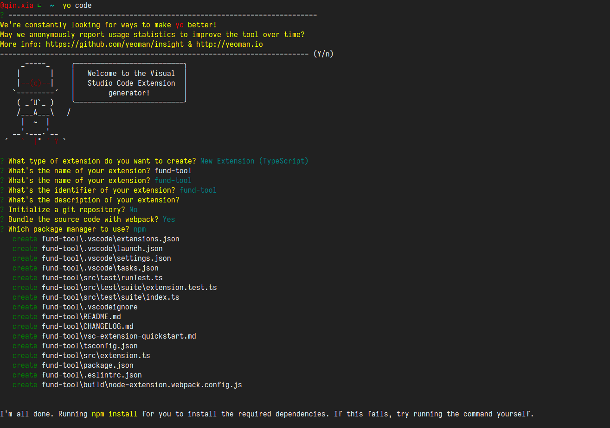

##### 初始化

使用vscode官方的插件模板，可以直接通过Yeoman来生成插件模板

先全局安装 yo 和 generator-code，运行命令 `yo code`

```javascript
# 全局安装 yo 模块

npm install -g yo generator-code
```

安装后

```
yo code启动按照提示填写信息
```



一个项目就初始化好了

package.json

```json
{
	"name": "fund-tool",
	"displayName": "fund-tool",
	"description": "",
	"version": "0.0.1",
	"engines": {
		"vscode": "^1.52.0"
	},
	"categories": [
		"Other"
	],
	"activationEvents": [
		"onCommand:fund-tool.helloWorld"
	],
	"main": "./dist/extension.js",
	"contributes": {
		"commands": [
			{
				"command": "fund-tool.helloWorld",
				"title": "Hello World"
			}
		]
	},
	"scripts": {
		"vscode:prepublish": "npm run package",
		"compile": "webpack --config ./build/node-extension.webpack.config.js",
		"watch": "webpack --watch --config ./build/node-extension.webpack.config.js",
		"package": "webpack --mode production --devtool hidden-source-map --config ./build/node-							extension.webpack.config.js",
		"test-compile": "tsc -p ./",
		"test-watch": "tsc -watch -p ./",
		"pretest": "npm run test-compile && npm run lint",
		"lint": "eslint src --ext ts",
		"test": "node ./out/test/runTest.js"
	},
	"devDependencies": {
		"@types/vscode": "^1.52.0",
		"@types/glob": "^7.1.3",
		"@types/mocha": "^8.0.4",
		"@types/node": "^12.11.7",
		"eslint": "^7.15.0",
		"@typescript-eslint/eslint-plugin": "^4.9.0",
		"@typescript-eslint/parser": "^4.9.0",
		"glob": "^7.1.6",
		"mocha": "^8.1.3",
		"typescript": "^4.1.2",
		"vscode-test": "^1.4.1",
		"ts-loader": "^8.0.11",
		"webpack": "^5.10.0",
		"webpack-cli": "^4.2.0"
	}
}

```


```
contributes：插件相关配置
activationEvents：激活事件
main：插件的入口文件，与 Npm 包表现一致。
name 、 publisher：name 是插件名，publisher 是发布者。 ${publisher}.${name} 构成插件 ID。
比较值得关注的就是 contributes 和 activationEvents 这两个配置。
```

##### 创建视图

我们首先在我们的应用中创建一个视图容器，视图容器简单来说一个单独的侧边栏，在 `package.json` 的 `contributes.viewsContainers` 中进行配置。

```javascript
"contributes": {
		"commands": [
			{
				"command": "fund-tool.helloWorld",
				"title": "Hello World"
			}
		],
		"viewsContainers": {
			"activitybar": [{
				"id": "fund-tool",
				"title": "FUND WATCH",
				"icon": "images/fund.svg"
			}]
		}
	},
```

然后我们还需要添加一个视图，在 `package.json` 的 `contributes.views` 中进行配置，该字段为一个对象，它的 Key 就是我们视图容器的 id，值为一个数组，表示一个视图容器内可添加多个视图。

```javascript
"contributes": {
		"commands": [
			{
				"command": "fund-tool.helloWorld",
				"title": "Hello World"
			}
		],
		"viewsContainers": {
			"activitybar": [{
				"id": "fund-tool",
				"title": "FUND WATCH",
				"icon": "images/fund.svg"
			}]
		},
		"views": {
			"fund-tool" : [
				{
					"name": "自选基金",
					"id": "fund-list"
				}
			]
		}
	},
```

如果你不希望在自定义的视图容器中添加，可以选择 VS Code 自带的视图容器。

- `explorer`: 显示在资源管理器侧边栏
- `debug`: 显示在调试侧边栏
- `scm`: 显示在源代码侧边栏

```
		"explorer": [{
				"name": "自选基金",
				"id": "fund-list"
			}]
```

##### 运行插件

使用 `Yeoman` 生成的模板自带 VS Code 运行能力。


##### 添加配置

我们需要获取基金的列表，当然需要一些基金代码，而这些代码我们可以放到 VS Code 的配置中。

```json
	"contributes": {
		// 胚子
		"configuration":{
			"type": "object", // 配置类型，对象
			"title": "fund",
			"properties": {
				"fund.favorites": {
					"type":"array",
					"default":[
						"163407",
						"161017"
					],
					"description": "自选基金列表，值为基金代码"
				},
				"fund.interval":{
					"type": "number",
					"default": 2,
					"description": "刷新时间，单位为秒，默认2秒"
				}
			}
		}
	},
```

##### 视图数据

我们回看之前注册的视图，VS Code 中称为树视图。

```json
		"views": {
			"fund-tool" : [
				{
					"name": "自选基金",
					"id": "fund-list"
				}
			]
		},
```

我们需要通过 vscode 提供的 `registerTreeDataProvider` 为视图提供数据。打开生成的 `src/extension.ts` 文件，修改代码如下：

```js
// vscode 模块为 VS Code 内置，不需要通过 npm 安装

import { ExtensionContext, commands, window, workspace } from "vscode";

import Provider from "./Provider";

// 激活插件

export function activate(context: ExtensionContext) {
  // 基金类

  const provider = new Provider();

  // 数据注册

  window.registerTreeDataProvider("fund-list", provider);
}

export function deactivate() {}

```

这里我们通过 VS Code 提供的 `window.registerTreeDataProvider` 来注册数据，传入的第一个参数表示视图 ID，第二个参数是 `TreeDataProvider` 的实现。

`TreeDataProvider` 有两个必须实现的方法：

- `getChildren`：该方法接受一个 element，返回 element 的子元素，如果没有element，则返回的是根节点的子元素，我们这里因为是单列表，所以不会接受 element 元素；
- `getTreeItem`：该方法接受一个 element，返回视图单行的 UI 数据，需要对 `TreeItem` 进行实例化；

我们通过 VS Code 的资源管理器来展示下这两个方法：

// provide.ts

```javascript
import { workspace, TreeDataProvider, TreeItem } from "vscode";

export default class DataProvider implements TreeDataProvider<string> {
  refresh() {
    // 更新视图
  }

  getTreeItem(element: string) {
    return new TreeItem(element);
  }

  getChildren(): string[] {
    const { order } = this;
    // 获取配置的基金
    const favorites: string[] = workspace
      .getConfiguration()
      .get("fund.favorities", []);

    // 依据代码排序

    return favorites.sort((prev, next) => (prev >= next ? 1 : -1) * order);
  }
}
```

现在运行之后，可能会发现视图上没有数据，这是因为没有配置激活事件。

```javascript
  "activationEvents": [
     "onview:fund-list"
  ],
```

##### 请求数据

我们已经成功将基金代码展示在视图上，接下来就需要请求基金数据了。网上有很多基金相关 api，这里我们使用天天基金网的数据。