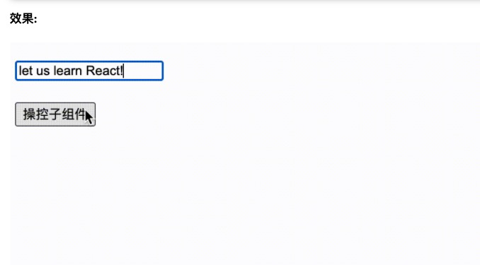

`useImperativeHandle` 可以配合 `forwardRef`自定义暴露给父组件的实例值。这个很有用，我们知道，对于子组件，如果是`class`类组件，我们可以通过`ref`获取类组件的实例，但是在子组件是函数组件的情况，如果我们不能直接通过`ref`的，那么此时`useImperativeHandle`和 `forwardRef`配合就能达到效果。

`useImperativeHandle`接受三个参数：

- 第一个参数ref: 接受 `forWardRef` 传递过来的 `ref`。
- 第二个参数 `createHandle` ：处理函数，返回值作为暴露给父组件的`ref`对象。
- 第三个参数 `deps`:依赖项 `deps`，依赖项更改形成新的`ref`对象。

**我们来模拟给场景，用`useImperativeHandle`，使得父组件能让子组件中的`input`自动赋值并聚焦。**



```react
function Son() {
  const inputRef = useRef(null)
  const [inputValue, setInputValue] = useState('');
  useImperativeHandle(ref, ()=> {
    const handles = {
      onFocus() {
        inputRef.current.focus()
      },
      onChangeValue(value){
        setInputValue(value)
      }
    }
    return handles
  }, [])
  return <div>
  	<input
    	placeholder = "请输入内容"
      ref={inputRef}
      value={inputValue}
    />
  </div>
}

const FowardSon = forwardRef(Son)

class Index extends React.Component{
  cur = null;
	handleClick = () =>{
    const {onFocus, onChangeValue} = this.cur
    onFocus()
    onChangeValue('let us learn React!')
  }
	render(){
    return <div style={{marginTop: '50px'}}>
      <ForwardSon ref={cur => this.cur = cur}/>
      <button onClick={this.handleClick}>操控子组件</button>
    </div>
  }
}

```

