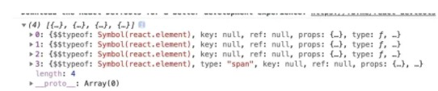
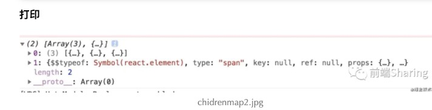

`React.Children` 提供了用于处理 `this.props.children` 不透明数据结构的实用方法。

注意： 不透明数据结构

```react
class Text extends React.Component{
    render(){
        return <div>hello,world</div>
    }
}
function WarpComponent(props){
    console.log(props.children)
    return props.children
}
function Index(){
    return <div style={{ marginTop:'50px' }} >
        <WarpComponent>
            <Text/>
            <Text/>
            <Text/>
            <span>hello,world</span>
        </WarpComponent>
    </div>
}
```



但是我们把`Index`结构改变一下：

```react
function Index(){
    return <div style={{ marginTop:'50px' }} >
        <WarpComponent>
            { new Array(3).fill(0).map(()=><Text/>) }
            <span>hello,world</span>
        </WarpComponent>
    </div>
}
```



这个数据结构，我们不能正常的遍历了，即使遍历也不能遍历，每一个子元素。此时就需要 `react.Chidren` 来帮忙了。

```react
function WarpComponent(props){
    const newChildren = React.Children.map(props.children,(item)=>item)
    console.log(newChildren)
    return newChildren
} 
```

**注意**如果 `children` 是一个 `Fragment` 对象，它将被视为单一子节点的情况处理，而不会被遍历。