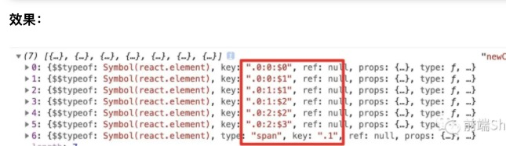

`Children.toArray`返回，`props.children`扁平化后结果。

```react
function WarpComponent(props){
    const newChidrenArray =  React.Children.toArray(props.children)
    console.log(newChidrenArray,'newChidrenArray')
    return newChidrenArray
}   
function Index(){
    return <div style={{ marginTop:'50px' }} >
        <WarpComponent>
            { new Array(3).fill(0).map((item,index)=>new Array(2).fill(1).map((item,index1)=><Text key={index+index1} />)) }
            <span>hello,world</span>
        </WarpComponent>
    </div>
}
```



**newChidrenArray** ,就是扁平化的数组结构。`React.Children.toArray()` 在拉平展开子节点列表时，更改 `key` 值以保留嵌套数组的语义。也就是说， `toArray` 会为返回数组中的每个 `key` 添加前缀，以使得每个元素 `key` 的范围都限定在此函数入参数组的对象内。

