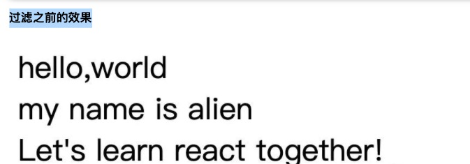
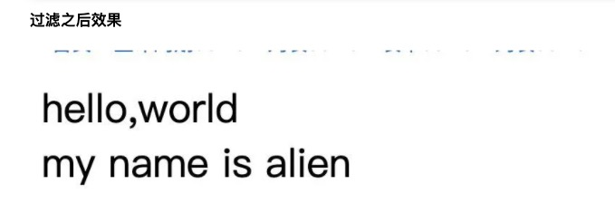

这个方法可以用来检测是否为`react element`元素,接受待验证对象，返回`true`或者`false`。这个api可能对于业务组件的开发，作用不大，因为对于组件内部状态，都是已知的，我们根本就不需要去验证，是否是`react element` 元素。但是，对于一起公共组件或是开源库，`isValidElement`就很有作用了。

实践：

我们做一个场景，验证容器组件的所有子组件，过滤到非`react element`类型。

没有用isValidElement验证之前：

```react
const Text = () => <div>hello,world</div> 
class WarpComponent extends React.Component{
    constructor(props){
        super(props)
    }
    render(){
        return this.props.children
    }
}
function Index(){
    return <div style={{ marginTop:'50px' }} >
        <WarpComponent>
            <Text/>
            <div> my name is alien </div>
            Let's learn react together!
        </WarpComponent>
    </div>
}
```



使用isValidElement进行react Element验证

```react
class WrapElement extends React.Component{
       constructor(props){
        super(props)
         this.newChildren = props.children.filter((v)=> React.isValidElement(v))
    	}
  		render() {
        return this.newChildren
      }
}
```



过滤掉了非`react element` 的 `Let's learn react together!`。

