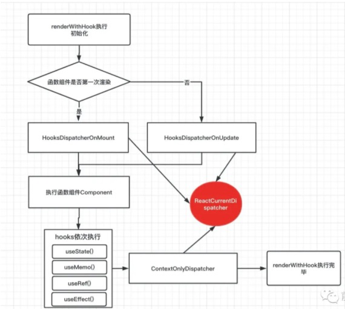
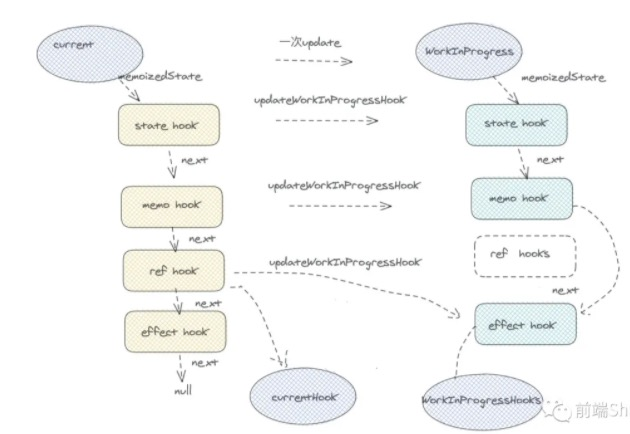
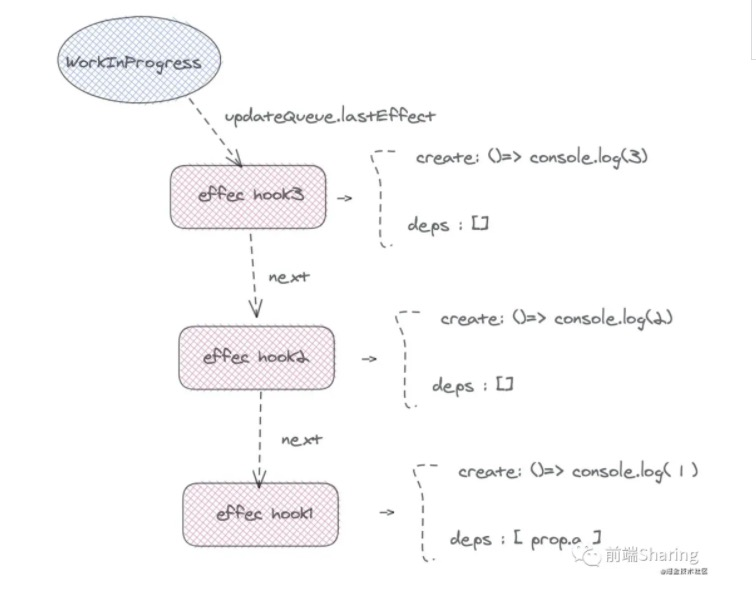

react-hooks实际就是函数组件解决**没有state, 生命周期，逻辑不能服用**的一种技术方案

问题：

- 在无状态组件每一次函数上下文执行的时候，react用什么方式记录了hooks的状态
- 多个react-hooks用什么来记录每一个hooks的顺序的？为什么不能条件语句中，声明hooks？ hooks声明为什么在组件的最顶部？
- function函数组件中的useState, 和class类组件setState有什么区别？
- react是怎么捕获到hooks的执行上下文，是在函数组件内部的？
- useEffect， useMemo中，为什么useRef不需要依赖注入，就能访问到最新的改变值？
- useMemo是怎么对值做缓存的？如何应用它优化性能
- 为什么两次传入useState的值相同，函数组件不更新？

>在类组件中，在setTimeout中执行setState会破坏批量更新

#### function组件和class组件本质的区别

```javascript

class Index extends React.Component<any,any>{
    constructor(props){
        super(props)
        this.state={
            number:0
        }
    }
    handerClick=()=>{
       for(let i = 0 ;i<5;i++){
           setTimeout(()=>{
               this.setState({ number:this.state.number+1 })
               console.log(this.state.number)
           },1000)
       }
    }

    render(){
        return <div>
            <button onClick={ this.handerClick } >num++</button>
        </div>
    }
}

// 1 2 3 4 5
```

```javascript

function Index(){
    const [ num ,setNumber ] = React.useState(0)
    const handerClick=()=>{
        for(let i=0; i<5;i++ ){
           setTimeout(() => {
                setNumber(num+1)
                console.log(num)
           }, 1000)
        }
    }
    return <button onClick={ handerClick } >{ num }</button>
}
// 0 0 0 0 0
```

第一个类组件中，由于执行上`setState`没有在`react`正常的函数执行上下文上执行，而是`setTimeout`中执行的，**批量更新**条件被破坏。原理这里我就不讲了,所以可以直接获取到变化后的`state`。

但是在无状态组件中，似乎没有生效。原因很简单，在`class`状态中，通过一个实例化的`class`，去维护组件中的各种状态；但是在`function`组件中，没有一个状态去保存这些信息，每一次函数上下文执行，所有变量，常量都重新声明，执行完毕，再被垃圾机制回收。所以如上，无论`setTimeout`执行多少次，都是在当前函数上下文执行,此时`num = 0`不会变，之后`setNumber`执行，函数组件重新执行之后，`num`才变化。

所以， 对于`class`组件，我们只需要实例化一次，实例中保存了组件的`state`等状态。对于每一次更新只需要调用`render`方法就可以。但是在`function`组件中，每一次更新都是一次新的函数执行,为了保存一些状态,执行一些副作用钩子,`react-hooks`应运而生，去帮助记录组件的状态，处理一些额外的副作用。

#### 无状态的函数组件执行

function函数是什么时候执行的呢？

react-reconciler/src/ReactFiberBeginWork.js

function组件初始化

```javascript
renderWithHooks() {
  null, // current Fiber
  workInProgress, // workInProgress Fiber
  Component, // 函数组件本身
  props， // props
  context， // 上下文
 	renderExpirationTime, // 渲染 ExpirationTime
}
```

对于初始化是没有`current`树的，之后完成一次组件更新后，会把当前`workInProgress`树赋值给`current`树。

`function`组件更新：

```javascript
renderWithHooks(
    current,
    workInProgress,
    render,
    nextProps,
    context,
    renderExpirationTime,
)
```

我们从上边可以看出来，`renderWithHooks`函数作用是**调用`function`组件函数**的主要函数。我们重点看看`renderWithHooks`做了些什么？

**renderWithHooks** `react-reconciler/src/ReactFiberHooks.js`

```javascript
export function renderWithHooks(
		current,
    workInProgress,
    Component,
    props,
    secondArg,
    nextRenderExpirationTime
) {
  renderExpirationTime = nextRenderExpirationTime;
  currentlyRenderingFiber = workInProgress;
  
  workInProgress.memoizedState = null;
  workInProgress.updateQueue = null;
  workInProgress.expirationTime = NoWork;

  ReactCurrentDispatcher.current = current === null || current.memoizedState === null?
    HooksDispatcherOnMount : HooksDispatcheOnUpdate
	
  let children = Component(props, secondArg);
  if(workInProgress.expirationTime === renderExpirationTime){
    // .... 这里的逻辑暂放
  }
  ReactCurrentDispatcher.current = ContextOnlyDispatcher;
  renderExpirationTime = NoWork;
  currentlyRenderingFiber = null;
  currentHook = null;
  workInProgressHook = null;
  
  didScheduleRenderPhaseUpdate = false;
  
  return children;
}
```

所有的函数组件执行，都是在这里方法中

`current fiber树`: 当完成一次渲染之后，会产生一个`current`树,`current`会在`commit`阶段替换成真实的`Dom`树。

`workInProgress fiber树`: 即将调和渲染的 `fiber` 树。再一次新的组件更新过程中，会从`current`复制一份作为`workInProgress`,更新完毕后，将当前的`workInProgress`树赋值给`current`树。

`workInProgress.memoizedState`: 在`class`组件中，`memoizedState`存放`state`信息，在`function`组件中，**这里可以提前透漏一下，`memoizedState`在一次调和渲染过程中，以链表的形式存放`hooks`信息。** 

`workInProgress.expirationTime`: `react`用不同的`expirationTime`,来确定更新的优先级。

`currentHook` : 可以理解 `current`树上的指向的当前调度的 `hooks`节点。

`workInProgressHook` : 可以理解 `workInProgress`树上指向的当前调度的 `hooks`节点。

`renderWithHooks`**函数主要作用:**

首先先置空即将调和渲染的`workInProgress`树的`memoizedState`和`updateQueue`，为什么这么做，因为在接下来的函数组件执行过程中，要把新的`hooks`信息挂载到这两个属性上，然后在组件`commit`阶段，将`workInProgress`树替换成`current`树，替换真实的`DOM`元素节点。并在`current`树保存`hooks`信息。

然后根据当前函数组件是否是第一次渲染，赋予`ReactCurrentDispatcher.current`不同的`hooks`,终于和上面讲到的`ReactCurrentDispatcher`联系到一起。对于第一次渲染组件，那么用的是`HooksDispatcherOnMount` hooks对象。对于渲染后，需要更新的函数组件，则是`HooksDispatcherOnUpdate`对象，那么两个不同就是通过`current`树上是否`memoizedState`（hook信息）来判断的。如果`current`不存在，证明是第一次渲染函数组件。

接下来，**调用`Component(props, secondArg);`执行我们的函数组件，我们的函数组件在这里真正的被执行了，然后，我们写的`hooks`被依次执行，把`hooks`信息依次保存到`workInProgress`树上。** 至于它是怎么保存的，我们马上会讲到。

接下来，也很重要，将`ContextOnlyDispatcher`赋值给` ReactCurrentDispatcher.current`，由于`js`是单线程的，也就是说我们没有在函数组件中，调用的`hooks`，都是`ContextOnlyDispatcher`对象上`hooks`,我们看看`ContextOnlyDispatcher`hooks，到底是什么。

```javascript
const ContextOnlyDispatcher = {
    useState:throwInvalidHookError
}
function throwInvalidHookError() {
  invariant(
    false,
    'Invalid hook call. Hooks can only be called inside of the body of a function component. This could happen for' +
      ' one of the following reasons:\n' +
      '1. You might have mismatching versions of React and the renderer (such as React DOM)\n' +
      '2. You might be breaking the Rules of Hooks\n' +
      '3. You might have more than one copy of React in the same app\n' +
      'See https://fb.me/react-invalid-hook-call for tips about how to debug and fix this problem.',
  );
}
```

`react-hooks`就是通过这种函数组件执行赋值不同的`hooks`对象方式，判断在`hooks`执行是否在函数组件内部，捕获并抛出异常的。

最后，重新置空一些变量比如`currentHook`，`currentlyRenderingFiber`,`workInProgressHook`等。

#### 不同的hooks对象

**第一次渲染(我这里只展示了常用的`hooks`)：**

 ```javascript

const HooksDispatcherOnMount = {
  useCallback: mountCallback,
  useEffect: mountEffect,
  useLayoutEffect: mountLayoutEffect,
  useMemo: mountMemo,
  useReducer: mountReducer,
  useRef: mountRef,
  useState: mountState,
};
 ```

**更新组件：**

 ```javascript

const HooksDispatcherOnUpdate = {
  useCallback: updateCallback,
  useEffect: updateEffect,
  useLayoutEffect: updateLayoutEffect,
  useMemo: updateMemo,
  useReducer: updateReducer,
  useRef: updateRef,
  useState: updateState
};
 ```

看来对于第一次渲染组件，和更新组件，`react-hooks`采用了两套`Api`

流程图来描述整个过程:



#### hooks初始化， hooks会变成什么样子？

重点围绕四个中重点`hooks`展开，分别是负责组件更新的`useState`，负责执行副作用`useEffect` ,负责保存数据的`useRef`,负责缓存优化的`useMemo`， 至于`useCallback`,`useReducer`,`useLayoutEffect`原理和那四个重点`hooks`比较相近，就不一一解释了。

```react
import React, {useEffect, useState, useRef, useMemo} from 'react'
function Index() {
  	const [number, setNumber] = useState(0)
    const DivDemo = useMemo(()=> <div>hello, i am useMemo</div>, [])
    const curRef = useRef(null)  
    useEffect(() => {
      console.log(curRef.current)
    }, [])
  	return <div ref={curRef}>
      hello world, {number}
  		{DivDemo}
      <button onClick={() => setNumber(number + 1)}>number++</button>
      </div>
}
```

##### mountWorkInProgressHook

在组件初始化的时候,每一次`hooks`执行，如`useState()`,`useRef()`,都会调用`mountWorkInProgressHook`,`mountWorkInProgressHook`到底做了些什么，让我们一起来分析一下：

react-reconciler/src/ReactFiberHooks.js -> mountWorkInProgressHook

```react
function mountWorkInProgresshook() {
  const hook: Hook = {
    memoizedState: null,
    // useState中保存state信息
    // useEffect中保存着effect对象
    // useMemo中保存的是缓存的值和deps
    // useRef中保存的是ref 对象
    baseState: null,
    baseQueue: null,
    queue: null,
    next: null,
  };
  if(workInProgressHook === null){
    // 例子中的第一个hooks useState(0)走的就是这样
    currentlyRenderingFiber.memoizedState = workInProgressHook = hook;
  }else {
    workInProgressHook = workInProgressHook.next = hook;
  }
  return workInProgressHook;
}
```

`mountWorkInProgressHook`这个函数做的事情很简单，首先每次执行一个`hooks`函数，都产生一个`hook`对象，里面保存了当前`hook`信息,然后将每个`hooks`以链表形式串联起来，并赋值给`workInProgress`的`memoizedState`。也就证实了上述所说的，函数组件用`memoizedState`存放`hooks`链表。

`hook`对象中都保留了哪些信息？

**memoizedState**： `useState中` 保存 `state` 信息 ｜ `useEffect` 中 保存着 `effect` 对象 ｜ `useMemo` 中 保存的是缓存的值和 `deps` ｜ `useRef` 中保存的是 `ref` 对象。

**baseQueue** : `usestate`和`useReducer`中 保存最新的更新队列。

**baseState** ： `usestate`和`useReducer`中,一次更新中 ，产生的最新`state`值。

**queue** ：保存待更新队列 `pendingQueue` ，更新函数 `dispatch` 等信息。

**next**: 指向下一个 `hooks`对象。


为什么hooks不能放在条件语句中

```react
// 如果我们将上述demo其中的一个 useRef 放入条件语句中，
 let curRef  = null
 if(isFisrt){
  curRef = useRef(null)
 }
```



可以看到，一旦有条件语句，下次更新组件，hooks链表结构将会被破化， `current`**树的**`memoizedState`**缓存**`hooks`**信息，和当前**`workInProgress`**不一致，如果涉及到读取**`state`**等操作，就会发生异常**

`hooks`通过什么来证明唯一性的？ hooks链表顺序

为什么不能在条件语句中，声明`hooks`？ hooks链表结构会被破化

#### 初始化useState ---> mountState

mountState

```react
function mountState(
	initialState
) {
  const hook = mountWorkInProgressHook();
  if(typeof initialState === 'function'){
    // 如果 useState 第一个参数为函数，执行函数得到state
		    initialState = initialState();			
  }
    hook.memoizedState = hook.baseState = initialState;
    const queue = (hook.queue = {
    pending: null,  // 带更新的
    dispatch: null, // 负责更新函数
    lastRenderedReducer: basicStateReducer, //用于得到最新的 state ,
    lastRenderedState: initialState, // 最后一次得到的 state
  });
    
  const dispatch = (queue.dispatch = (dispatchAction.bind( // 负责更新的函数
    null,
    currentlyRenderingFiber,
    queue,
  )))
  return [hook.memoizedState, dispatch];
}
```

`mountState`到底做了些什么，首先会得到初始化的`state`，将它赋值给`mountWorkInProgressHook`产生的`hook`对象的 `memoizedState`和`baseState`属性，然后创建一个`queue`对象，里面保存了负责更新的信息。

在无状态组件中，`useState`和`useReducer`触发函数更新的方法都是`dispatchAction`, `useState`，可以看成一个简化版的`useReducer`,至于`dispatchAction`怎么更新`state`，更新组件的，我们接着往下研究`dispatchAction`。

`dispatchAction`**是什么?**

```react
function dispatchAction<S, A>(
	fiber: Fiber,
  queue: UpdateQueue<S, A>,
  action: A
)
const [number, serNumber] = useState(0)
```

**`dispatchAction` 就是 `setNumber`** , `dispatchAction` 第一个参数和第二个参数，已经被`bind`给改成`currentlyRenderingFiber`和 `queue`,我们传入的参数是第三个参数`action`

#### dispatchAction 无状态组件更新机制

更新的主要函数

```react
function dispatchAction(fiber, queue, action) {
  // 计算expirationTime 过程略过
  /* 创建一个update */
  const update = {
    expirationTime,
    suspenseConfig,
    action,
    eagerReducer: null,
    eagerState: null,
    next: null
  }
  /* update.next */
  const pending = queue.pending;
  if(pending === null){
    update.next = update;
  }else{ // 不是第一次更新
    update.next = pending.next;
    pending.next = update;
  }
  
  queue.pending = update;
  const alternate = fiber.alternate;
  /* 判断当前是否在渲染阶段 */
  if(fiber === currentlyRenderingFiber || (alternate !== null && alternate === currentlyRenderingFiber)){
    didScheduleRenderPhaseUpdate = true;
    update.expirationTime = renderExpirationTime;
    currentlyRenderingFiber.expirationTime = renderExpirationTime;
  } else{ /* 当前函数组件对应fiber没有处于调和渲染阶段 ，那么获取最新state , 执行更新 */
    if(fiber.expirationTime === NoWork && (alternate === null || alternate.expirationTime === NoWork)){
      const lastRenderedReducer = queue.lastRenderedReducer;
      if(lastRenderedReducer !== null){
        let prevDispatcher;
        try{
          const currentState = queue.lastRenderedState; /* 上一次的state */
          const eagerState = lastRenderedReducer(currentState, action);
          update.eagerReducer = lastRenderedReducer;
          update.eagerState = eagerState;
          if(is(eagerState, currentState)){
            return
          }
        }
      }
    }
    scheduleUpdateOnFiber(fiber, expirationTime)
  }
}
```

无论是类组件调用`setState`,还是函数组件的`dispatchAction` ，都会产生一个 `update`对象，里面记录了此次更新的信息，然后将此`update`放入待更新的`pending`队列中，`dispatchAction`第二步就是判断当前函数组件的`fiber`对象是否处于渲染阶段，如果处于渲染阶段，那么不需要我们再更新当前函数组件，只需要更新一下当前`update`的`expirationTime`即可。

如果当前`fiber`没有处于更新阶段。那么通过调用`lastRenderedReducer`获取最新的`state`,和上一次的`currentState`，进行浅比较，如果相等，那么就退出，这就证实了为什么`useState`，两次值相等的时候，组件不渲染的原因了，这个机制和`Component`模式下的`setState`有一定的区别。

如果两次`state`不相等，那么调用`scheduleUpdateOnFiber`调度渲染当前`fiber`，`scheduleUpdateOnFiber`是`react`渲染更新的主要函数。

#### 初始化useEffect --> mountEffect

无状态组件中fiber对象memoizedState保存当前的hooks形成的链表

mountEffect

```react
function mountEffect(
	create,
  deps
) {
    const hook = mountWorkInProgressHook();
    const nextDeps = deps === undefined? null : deps;
    hook.memoizedState = pushEffect(
    	HookHasEffect | hookEffectTag,
      create, // useEffect 第一次参数，就是副作用函数
      undefined,
      nextDeps, // useEffect 第二次参数，deps
    )
  }
```

每个`hooks`初始化都会创建一个`hook`对象，然后将hook的`memoizedState`保存当前`effect hook`信息。

**有两个`memoizedState`**

- workInProgress / current 树上的 `memoizedState` 保存的是当前函数组件每个`hooks`形成的链表。

- 每个`hooks`上的`memoizedState` 保存了当前`hooks`信息，不同种类的`hooks`的`memoizedState`内容不同。上述的方法最后执行了一个`pushEffect`，我们一起看看`pushEffect`做了些什么？

#### pushEffect 创建effect对象，挂载updateQueue

```react
function pushEffect(tag, create, destroy, deps) {
  const effect = {
     tag,
    create,
    destroy,
    deps,
    next: null,
  }
    let componentUpdateQueue = currentlyRenderingFiber.updateQueue
		    if(componentUpdateQueue === null){// 如果是第一个 useEffect
              componentUpdateQueue = {  lastEffect: null  }
    					currentlyRenderingFiber.updateQueue = componentUpdateQueue
    					componentUpdateQueue.lastEffect = effect.next = effect;
        }else{// 存在多个effect
              const lastEffect = componentUpdateQueue.lastEffect;
							if(lastEffect === null){
                      componentUpdateQueue.lastEffect = effect.next = effect;

              }else{
                  const firstEffect = lastEffect.next;
      						lastEffect.next = effect;
     						 effect.next = firstEffect;
     						 componentUpdateQueue.lastEffect = effect;
              }
        }
    return effect
}
```

这一段实际很简单，首先创建一个 `effect` ，判断组件如果第一次渲染，那么创建 `componentUpdateQueue` ，就是`workInProgress`的`updateQueue`。然后将`effect`放入`updateQueue`中，不过这里顺序要注意，越靠后的`effect`，越在`updateQueue`前边。

 假设我们在一个函数组件中这么写：

 ```react
useEffect(()=>{
    console.log(1)
},[ props.a ])
useEffect(()=>{
    console.log(2)
},[])
useEffect(()=>{
    console.log(3)
},[])
 ```

最后`workInProgress.updateQueue`会以这样的形式保存：



### 拓展:effectList

`effect list` 可以理解为是一个存储 `effectTag` 副作用列表容器。它是由 `fiber` 节点和指针 `nextEffect` 构成的单链表结构，这其中还包括第一个节点 `firstEffect` ，和最后一个节点 `lastEffect`。 `React` 采用深度优先搜索算法，在 `render` 阶段遍历 `fiber` 树时，把每一个有副作用的 `fiber` 筛选出来，最后构建生成一个只带副作用的 `effect list` 链表。在 `commit` 阶段，`React` 拿到 `effect list` 数据后，通过遍历 `effect list`，并根据每一个 `effect` 节点的 `effectTag` 类型，执行每个`effect`，从而对相应的 `DOM` 树执行更改。

#### 初始化useMemo --> mountMemo

```react
function mountMemo(nextCreate, deps){
  const hook = mountWorkInProgressHook();
  const nextDeps = deps === undefined ? null : deps;
  const nextValue = nextCreate();
  hook.memoizedState = [nextValue, nextDeps];
	return nextValue
}
```

初始化`useMemo`，就是创建一个`hook`，然后执行`useMemo`的第一个参数,得到需要缓存的值，然后将值和`deps`记录下来，赋值给当前`hook`的`memoizedState`。整体上并没有复杂的逻辑。

#### 初始化useRef ---> mountRef

```react
function mountRef(initialValue) {
  const hook = mountWorkInProgressHook();
  const ref = {current: initialValue};
  hook.memoizedState = ref;
  return ref;
}
```

`mountRef`初始化很简单, 创建一个ref对象， 对象的`current` 属性来保存初始化的值，最后用`memoizedState`保存`ref`，完成整个操作。

#### mounted阶段hooks总结

我们来总结一下初始化阶段,`react-hooks`做的事情，在一个函数组件第一次渲染执行上下文过程中，每个`react-hooks`执行，都会产生一个`hook`对象，并形成链表结构，绑定在`workInProgress`的`memoizedState`属性上，然后`react-hooks`上的状态，绑定在当前`hooks`对象的`memoizedState`属性上。对于`effect`副作用钩子，会绑定在`workInProgress.updateQueue`上，等到`commit`阶段，`dom`树构建完成，在执行每个 `effect` 副作用钩子。

