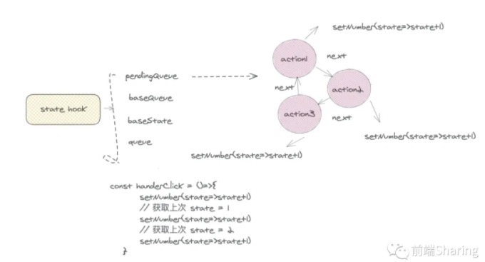
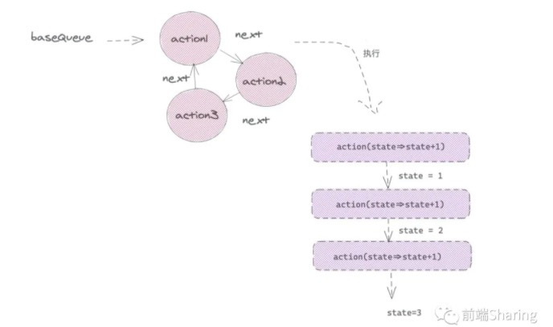

### hooks更新阶段

初始化阶段react-hooks做的事情

执行每个react-hooks， 生成hooks对象，并形成链表结构，绑定在workInProgress的memoizedState属性上

react-hooks的状态，绑定到当前hooks对象的memoizedState属性上

effect副作用钩子，绑定在workInProgress.updateQueue上，等到commit阶段，dom树构建完成，再执行effect副作用钩子

对于更新阶段，说明上一次 `workInProgress` 树已经赋值给了 `current` 树。存放`hooks`信息的`memoizedState`，此时已经存在`current`树上，`react`对于`hooks`的处理逻辑和`fiber`树逻辑类似。

对于一次函数组件更新，当再次执行`hooks`函数的时候，比如 `useState(0)` ，首先要从`current`的`hooks`中找到与当前`workInProgressHook`，对应的`currentHooks`，然后复制一份`currentHooks`给`workInProgressHook`,接下来`hooks`函数执行的时候,把最新的状态更新到`workInProgressHook`，保证`hooks`状态不丢失。

所以函数组件每次更新，每一次`react-hooks`函数执行，都需要有一个函数去做上面的操作，这个函数就是`updateWorkInProgressHook`,我们接下来一起看这个`updateWorkInProgressHook`。

- unpdateWorkInProgressHook

```react

function updateWorkInProgressHook() {
  let nextCurrentHook;
  if (currentHook === null) {  /* 如果 currentHook = null 证明它是第一个hooks */
    const current = currentlyRenderingFiber.alternate;
    if (current !== null) {
      nextCurrentHook = current.memoizedState;
    } else {
      nextCurrentHook = null;
    }
  } else { /* 不是第一个hooks，那么指向下一个 hooks */
    nextCurrentHook = currentHook.next;
  }
  let nextWorkInProgressHook
  if (workInProgressHook === null) {  //第一次执行hooks
    // 这里应该注意一下，当函数组件更新也是调用 renderWithHooks ,memoizedState属性是置空的
    nextWorkInProgressHook = currentlyRenderingFiber.memoizedState;
  } else { 
    nextWorkInProgressHook = workInProgressHook.next;
  }

  if (nextWorkInProgressHook !== null) { 
      /* 这个情况说明 renderWithHooks 执行 过程发生多次函数组件的执行 ，我们暂时先不考虑 */
    workInProgressHook = nextWorkInProgressHook;
    nextWorkInProgressHook = workInProgressHook.next;
    currentHook = nextCurrentHook;
  } else {
    invariant(
      nextCurrentHook !== null,
      'Rendered more hooks than during the previous render.',
    );
    currentHook = nextCurrentHook;
    const newHook = { //创建一个新的hook
      memoizedState: currentHook.memoizedState,
      baseState: currentHook.baseState,
      baseQueue: currentHook.baseQueue,
      queue: currentHook.queue,
      next: null,
    };
    if (workInProgressHook === null) { // 如果是第一个hooks
      currentlyRenderingFiber.memoizedState = workInProgressHook = newHook;
    } else { // 重新更新 hook
      workInProgressHook = workInProgressHook.next = newHook;
    }
  }
  return workInProgressHook;
}
```

首先如果是第一次执行`hooks`函数，那么从`current`树上取出`memoizedState` ，也就是旧的`hooks`。

然后声明变量`nextWorkInProgressHook`，这里应该值得注意，正常情况下，一次`renderWithHooks`执行，`workInProgress`上的`memoizedState`会被置空，`hooks`函数顺序执行，`nextWorkInProgressHook`应该一直为`null`，那么什么情况下`nextWorkInProgressHook`不为`null`,也就是当一次`renderWithHooks`执行过程中，执行了多次函数组件，也就是在`renderWithHooks`中这段逻辑。

```react
  if (workInProgress.expirationTime === renderExpirationTime) { 
       // ....这里的逻辑我们先放一放
  }
```

这里面的逻辑，实际就是判定，如果当前函数组件执行后，当前函数组件的还是处于渲染优先级，说明函数组件又有了新的更新任务，那么循坏执行函数组件。这就造成了上述的，`nextWorkInProgressHook`不为 `null` 的情况。

最后复制`current`的`hooks`，把它赋值给`workInProgressHook`,用于更新新的一轮`hooks`状态。

- updateState

```react
function updateReducer(
  reducer,
  initialArg,
  init,
){
  const hook = updateWorkInProgressHook();
  const queue = hook.queue;
  queue.lastRenderedReducer = reducer;
  const current = currentHook;
  let baseQueue = current.baseQueue;
  const pendingQueue = queue.pending;
  if (pendingQueue !== null) {
     // 这里省略... 第一步：将 pending  queue 合并到 basequeue
  }
  if (baseQueue !== null) {
    const first = baseQueue.next;
    let newState = current.baseState;
    let newBaseState = null;
    let newBaseQueueFirst = null;
    let newBaseQueueLast = null;
    let update = first;
    do {
      const updateExpirationTime = update.expirationTime;
      if (updateExpirationTime < renderExpirationTime) { //优先级不足
        const clone  = {
          expirationTime: update.expirationTime,
          ...
        };
        if (newBaseQueueLast === null) {
          newBaseQueueFirst = newBaseQueueLast = clone;
          newBaseState = newState;
        } else {
          newBaseQueueLast = newBaseQueueLast.next = clone;
        }
      } else {  //此更新确实具有足够的优先级。
        if (newBaseQueueLast !== null) {
          const clone= {
            expirationTime: Sync, 
             ...
          };
          newBaseQueueLast = newBaseQueueLast.next = clone;
        }
        /* 得到新的 state */
        newState = reducer(newState, action);
      }
      update = update.next;
    } while (update !== null && update !== first);
    if (newBaseQueueLast === null) {
      newBaseState = newState;
    } else {
      newBaseQueueLast.next = newBaseQueueFirst;
    }
    hook.memoizedState = newState;
    hook.baseState = newBaseState;
    hook.baseQueue = newBaseQueueLast;
    queue.lastRenderedState = newState;
  }
  const dispatch = queue.dispatch
  return [hook.memoizedState, dispatch];
}
```

这一段看起来很复杂，让我们慢慢吃透，首先将上一次更新的`pending queue` 合并到 `basequeue`，为什么要这么做，比如我们在一次点击事件中这么写，

 ```react

function Index(){
   const [ number ,setNumber ] = useState(0)
   const handerClick = ()=>{
    //    setNumber(1)
    //    setNumber(2)
    //    setNumber(3)
       setNumber(state=>state+1)
       // 获取上次 state = 1 
       setNumber(state=>state+1)
       // 获取上次 state = 2
       setNumber(state=>state+1)
   }
   console.log(number) // 3 
   return <div>
       <div>{ number }</div>
       <button onClick={ ()=> handerClick() } >点击</button>
   </div>
}
 ```

**点击按钮， 打印 3**

三次`setNumber`产生的`update`会暂且放入`pending queue`，在下一次函数组件执行时候，三次 `update`被合并到 `baseQueue`。结构如下图：




接下来会把当前`useState`或是`useReduer`对应的`hooks`上的`baseState`和`baseQueue`更新到最新的状态。会循环`baseQueue`的`update`，复制一份`update`,更新 `expirationTime`，对于有足够优先级的`update`（上述三个`setNumber`产生的`update`都具有足够的优先级），我们要获取最新的`state`状态。，会一次执行`useState`上的每一个`action`。得到最新的`state`。



问题一：这里不是执行最后一个`action`不就可以了嘛?

答案：原因很简单，上面说了 `useState`逻辑和`useReducer`差不多。如果第一个参数是一个函数，会引用上一次 `update`产生的 `state`, 所以需要**循环调用，每一个`update`的`reducer`**，如果`setNumber(2)`是这种情况，那么只用更新值，如果是`setNumber(state=>state+1)`,那么传入上一次的 `state` 得到最新`state`。

问题二：什么情况下会有优先级不足的情况(`updateExpirationTime < renderExpirationTime`)？

答案：这种情况，一般会发生在，当我们调用`setNumber`时候，调用`scheduleUpdateOnFiber`渲染当前组件时，又产生了一次新的更新，所以把最终执行`reducer`更新`state`任务交给下一次更新

- updateEffect

```react
function updateEffect(create, deps): void {
  const hook = updateWorkInProgressHook();
  const nextDeps = deps === undefined ? null : deps;
  let destroy = undefined;
  if (currentHook !== null) {
    const prevEffect = currentHook.memoizedState;
    destroy = prevEffect.destroy;
    if (nextDeps !== null) {
      const prevDeps = prevEffect.deps;
      if (areHookInputsEqual(nextDeps, prevDeps)) {
        pushEffect(hookEffectTag, create, destroy, nextDeps);
        return;
      }
    }
  }
  currentlyRenderingFiber.effectTag |= fiberEffectTag
  hook.memoizedState = pushEffect(
    HookHasEffect | hookEffectTag,
    create,
    destroy,
    nextDeps,
  );
}
```

`useEffect` 做的事很简单，判断两次`deps` 相等，如果相等说明此次更新不需要执行，则直接调用 `pushEffect`,这里注意 `effect`的标签，`hookEffectTag`,如果不相等，那么更新 `effect` ,并且赋值给`hook.memoizedState`，这里标签是 `HookHasEffect | hookEffectTag`,然后在`commit`阶段，`react`会通过标签来判断，是否执行当前的 `effect` 函数。

- updateMemo

```react

function updateMemo(
  nextCreate,
  deps,
) {
  const hook = updateWorkInProgressHook();
  const nextDeps = deps === undefined ? null : deps; // 新的 deps 值
  const prevState = hook.memoizedState; 
  if (prevState !== null) {
    if (nextDeps !== null) {
      const prevDeps = prevState[1]; // 之前保存的 deps 值
      if (areHookInputsEqual(nextDeps, prevDeps)) { //判断两次 deps 值
        return prevState[0];
      }
    }
  }
  const nextValue = nextCreate();
  hook.memoizedState = [nextValue, nextDeps];
  return nextValue;
}
```

在组件更新过程中，我们执行`useMemo`函数，做的事情实际很简单，就是判断两次 `deps`是否相等，如果不想等，证明依赖项发生改变，那么执行 `useMemo`的第一个函数，得到新的值，然后重新赋值给`hook.memoizedState`,如果相等 证明没有依赖项改变，那么直接获取缓存的值。

不过这里有一点，值得注意，`nextCreate()`执行，如果里面引用了`usestate`等信息，变量会被引用，无法被垃圾回收机制回收，就是闭包原理，那么访问的属性有可能不是最新的值，所以需要把引用的值，添加到依赖项 `dep` 数组中。每一次`dep`改变，重新执行，就不会出现问题了。

**温馨小提示：有很多同学说 `useMemo`怎么用，到底什么场景用，用了会不会起到反作用，通过对源码原理解析，我可以明确的说，基本上可以放心使用，说白了就是可以定制化缓存，存值取值而已。**

- updateRef

```react

function updateRef(initialValue){
  const hook = updateWorkInProgressHook()
  return hook.memoizedState
}
```

函数组件更新useRef做的事情更简单，就是返回了缓存下来的值，也就是无论函数组件怎么执行，执行多少次，`hook.memoizedState`内存中都指向了一个对象，所以解释了`useEffect`,`useMemo` 中，为什么`useRef`不需要依赖注入，就能访问到最新的改变值。