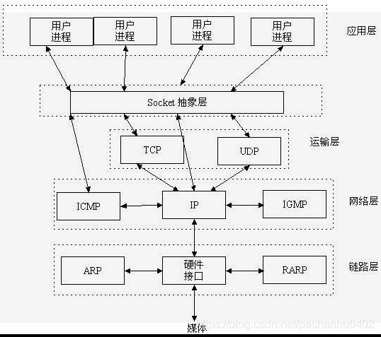
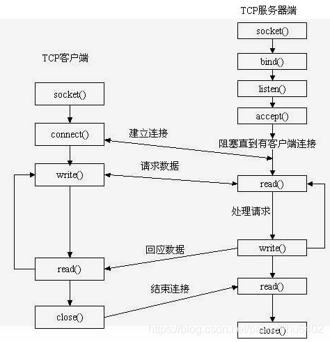
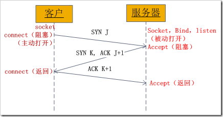
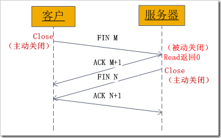
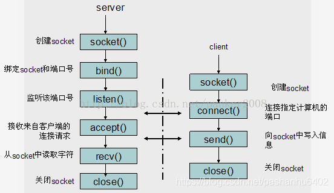

#### Socket在哪里？



#### Socket是什么？   

Socket是应用层与TCP/IP协议族通信的中间软件抽象层，它是一组接口。



#### Socket的基本操作

 socket是“open—write/read—close”模式的一种实现

- socket()函数： **socket()**用于创建一个socket描述符（socket descriptor），它唯一标识一个socket

  ```javascript
  int socket(int domain, int type, int protocol);
  ```

  - 参数

    - domain: 即协议域，又称为协议族（family）

      常用的协议族有，AF_INET、AF_INET6、AF_LOCAL（或称AF_UNIX，Unix域socket）、AF_ROUTE等等。协议族决定了socket的地址类型，在通信中必须采用对应的地址，如AF_INET决定了要用ipv4地址（32位的）与端口号（16位的）的组合、AF_UNIX决定了要用一个绝对路径名作为地址。

    - type: 指定socket类型

      常用的socket类型有，SOCK_STREAM、SOCK_DGRAM、SOCK_RAW、SOCK_PACKET、SOCK_SEQPACKET等等

    - protocol

      常用的协议有，IPPROTO_TCP、IPPTOTO_UDP、IPPROTO_SCTP、IPPROTO_TIPC等，它们分别对应TCP传输协议、UDP传输协议、STCP传输协议、TIPC传输协议

    注意：并不是上面的type和protocol可以随意组合的，如SOCK_STREAM不可以跟IPPROTO_UDP组合。当protocol为0时，会自动选择type类型对应的默认协议。

    当我们调用**socket**创建一个socket时，返回的socket描述字它存在于协议族（address family，AF_XXX）空间中，但没有一个具体的地址。如果想要给它赋值一个地址，就必须调用bind()函数，否则就当调用connect()、listen()时系统会自动随机分配一个端口。

- bind()函数： 

  ```javascript
  int bind(int sockfd, const struct sockaddr *addr, socklen_t addrlen);
  ```

  把一个地址族中的特定地址赋给socket， 例如对应AF_INET、AF_INET6就是把一个ipv4或ipv6地址和端口号组合赋给socket。

  - 参数
    - sockfd: 即socket描述字，它是通过socket()函数创建了，唯一标识一个socket。bind()函数就是将给这个描述字绑定一个名字。
    - addr : 指针，指向要绑定给sockfd的协议地址, 协议族不同地址结构不同
    - addrlen : 地址的长度

  通常服务器在启动的时候都会绑定一个众所周知的地址（如ip地址+端口号），用于提供服务，客户就可以通过它来接连服务器；而客户端就不用指定，有系统自动分配一个端口号和自身的ip地址组合。这就是为什么通常服务器端在listen之前会调用bind()，而客户端就不会调用，而是在connect()时由系统随机生成一个。

  >### 网络字节序与主机字节序
  >
  >**主机字节序**就是我们平常说的大端和小端模式：不同的CPU有不同的字节序类型，这些字节序是指整数在内存中保存的顺序，这个叫做主机序。引用标准的Big-Endian和Little-Endian的定义如下：
  >
  >　　a) Little-Endian就是低位字节排放在内存的低地址端，高位字节排放在内存的高地址端。
  >
  >　　b) Big-Endian就是高位字节排放在内存的低地址端，低位字节排放在内存的高地址端。
  >
  >**网络字节序**：4个字节的32 bit值以下面的次序传输：首先是0～7bit，其次8～15bit，然后16～23bit，最后是24~31bit。这种传输次序称作大端字节序。**由于TCP/IP首部中所有的二进制整数在网络中传输时都要求以这种次序，因此它又称作网络字节序。**字节序，顾名思义字节的顺序，就是大于一个字节类型的数据在内存中的存放顺序，一个字节的数据没有顺序的问题了。
  >
  >所以： 在将一个地址绑定到socket的时候，请先将主机字节序转换成为网络字节序，而不要假定主机字节序跟网络字节序一样使用的是Big-Endian。由于 这个问题曾引发过血案！公司项目代码中由于存在这个问题，导致了很多莫名其妙的问题，所以请谨记对主机字节序不要做任何假定，务必将其转化为网络字节序再 赋给socket。

  主机字节序需要先转化成网络字节序再赋值给socket

- listen()、connect()函数

如果作为一个服务器，在调用socket()、bind()之后就会调用listen()来监听这个socket，如果客户端这时调用connect()发出连接请求，服务器端就会接收到这个请求。

```javascript
int listen(int sockfd, int backlog); //sockfd: socket描述字  backlog: 可以排队的最大连接个数socket()函数创建的socket默认是一个主动类型的，listen函数将socket变为被动类型的，等待客户的连接请求。
int connect(int sockfd, const struct sockaddr *addr, socklen_t addrlen);// sockfd: 客户端的socket描述字
// addr: 服务器的socket地址 addrlen: socket地址的长度   客户端通过调用connect函数来建立与TCP服务器的连接。
```

- accept函数

  服务器端通过accept函数接收请求

```javascript
int accept(int sockfd, struct sockaddr *addr, socklen_t *addrlen); // 如果accpet成功，那么其返回值是由内核自动生成的一个全新的描述字，代表与返回客户的TCP连接。
```

注意：accept的第一个参数为服务器的socket描述字，是服务器开始调用socket()函数生成的，称为监听socket描述字；而accept函数返回的是已连接的socket描述字。一个服务器通常通常仅仅只创建一个监听socket描述字，它在该服务器的生命周期内一直存在。内核为每个由服务器进程接受的客户连接创建了一个已连接socket描述字，当服务器完成了对某个客户的服务，相应的已连接socket描述字就被关闭。

- read()、write()等函数

服务器与客户端建立起联系后，就可以调用网络I/O进行读写操作了

网络I/O操作有下面几组：

​	read()/write()

​	recv()/send()

​	readv()/writev()

​	recvmsg()/sendmsg()

​	recvfrom()/sendto()

recvmsg()/sendmsg()函数，这两个函数是最通用的I/O函数

​	-- read 操作返回值是0: 已经读到文件的结束  <0出现错误。如果错误为EINTR说明读是由中断引起的，如果是ECONNREST表示网络连接出了问题。

​	-- write操作 返回值： 成功返回字节数 失败返回-1，并设置errno 变量

​		1)write的返回值大于0，表示写了部分或者是 全部的数据。

​		2)返回的值小于0，此时出现了错误。我们要根据错误类型来处理。如果错误为EINTR表示在写的时候出现了中断错误。如果为EPIPE表示 网络连接出现了问题(对方已经关闭了连接)。

- close()函数

```
int close(int fd);
```

注意：close操作只是使相应socket描述字的引用计数-1，只有当引用计数为0的时候，才会触发TCP客户端向服务器发送终止连接请求。

#### socket中TCP的三次握手建立连接详解

大致流程如下：

- 客户端向服务器发送一个SYN J
- 服务器向客户端响应一个SYN K，并对SYN J进行确认ACK J+1
- 客户端再想服务器发一个确认ACK K+1



从图中可以看出，当客户端调用connect时，触发了连接请求，向服务器发送了SYN J包，这时connect进入阻塞状态；服务器监听到连接请求，即收到SYN J包，调用accept函数接收请求向客户端发送SYN K ，ACK J+1，这时accept进入阻塞状态；客户端收到服务器的SYN K ，ACK J+1之后，这时connect返回，并对SYN K进行确认；服务器收到ACK K+1时，accept返回，至此三次握手完毕，连接建立。

> 总结：客户端的connect在三次握手的第二个次返回，而服务器端的accept在三次握手的第三次返回。

#### socket中TCP的四次握手释放连接

上面介绍了socket中TCP的三次握手建立过程，及其涉及的socket函数。现在我们介绍socket中的四次握手释放连接的过程，请看下图：



图示过程如下：

- 某个应用进程首先调用close主动关闭连接，这时TCP发送一个FIN M；
- 另一端接收到FIN M之后，执行被动关闭，对这个FIN进行确认。它的接收也作为文件结束符传递给应用进程，因为FIN的接收意味着应用进程在相应的连接上再也接收不到额外数据；
- 一段时间之后，接收到文件结束符的应用进程调用close关闭它的socket。这导致它的TCP也发送一个FIN N；
- 接收到这个FIN的源发送端TCP对它进行确认。

这样每个方向上都有一个FIN和ACK。



