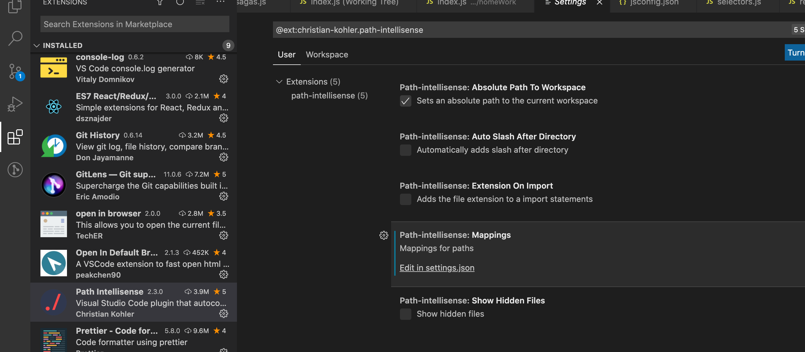

方法一：（推荐，实测有效）

在项目下添加jsconfig.json 文件

```json
{
  "compilerOptions": {
    "target": "es2015",
      "baseUrl": "./" , // 配置根路径
    	"module": "commonjs", // 必须配置，不配置如果省略路径index会无法跳转
       "paths":{
				"app/*" : ["./app/*"], // 配置webpack 对应别名
         "components/*": ["./app/components/*"],
         "utils/*": ["./app/utils/*"]
       }
  }
}
```

attention:  "module": "commonjs"不配置， 路径必须写全

比如： 

```javascript
import ErrorBoundary from 'components/ErrorBoundary/index' 
//  如果省略index就没法通过ctrl/command + click 直接跳转到对应位置
```

重启vscode


方法二：

配置import 别名提示

安装插件：Path Intellisense

配置：在setting.json 中添加配置



```javascript
    "path-intellisense.mappings": {
       "components": "${workspaceRoot}/app/components",
       "utils": "${workspaceRoot}/app/utils"
    }
```

在引入别名下的文件是就会有提示