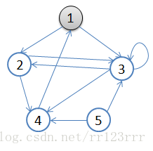
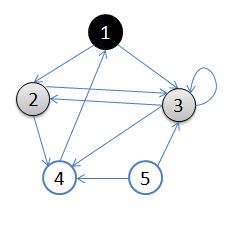
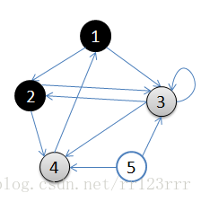
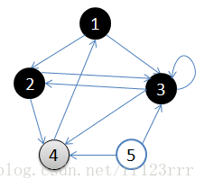
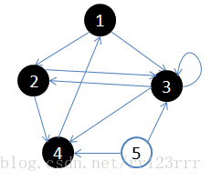

## 深度优先遍历（DFS: Depth-First-Search) 和广度优先遍历（BFS: Breadth-First-Search)

https://blog.csdn.net/rr123rrr/article/details/77971771

https://www.jianshu.com/p/70952b51f0c8

图的搜索方式有两种： DFS 和 BFS

图的用途：作为模型定义对象之间的关系

图的构成： 顶点v + 边E (v的是对象， E是对象间的关系）

图的种类： 有向图 ， 无向图

图的基本算法： 遍历： DFS BFS (按照访问节点的顺序区分)

图片：

### BFS： 使用对列

搜索顺序： 在进一步搜索下一个顶点之前，搜索当前顶点的所有邻接节点

a .首先选择一个顶点作为起始结点，并将其染成灰色，其余结点为白色。
 b. 将起始结点放入队列中。
 c. 从队列首部选出一个顶点，并找出所有与之邻接的结点，将找到的邻接结点放入队列尾部，将已访问过结点涂成黑色，没访问过的结点是白色。如果顶点的颜色是灰色，表示已经发现并且放入了队列，如果顶点的颜色是白色，表示还没有发现
 d. 按照同样的方法处理队列中的下一个结点。
 基本就是出队的顶点变成黑色，在队列里的是灰色，还没入队的是白色。

流程图如下：


​																                  	初始状态，从顶点1开始，队列 {1}



​																		从队列取出顶点1， 1变黑，查找1关联节点2和3，放入队列尾，队列 {2,3}



​																	取出对首2,2变黑，2关联节点4和3,3已经有，4入队，队列 {3， 4}



​																取出对首3，3变黑 查找到4,2， 4在队列，2已经查过，没有邻接点， 队列 {4}



​																	取出对首4， 4变黑，邻接点1，已经变黑，所以没有邻接点，队列 null

从顶点1开始进行广度优先搜索：

初始状态，从顶点1开始，队列={1}

访问1的邻接顶点，1出队变黑，2,3入队，队列={2,3,}

访问2的邻接结点，2出队，4入队，队列={3,4}

访问3的邻接结点，3出队，队列={4}

访问4的邻接结点，4出队，队列={ 空}
 结点5对于1来说不可达。

上面的图通过矩阵表示：

```javascript
const maze[5][5] = {
    {0,1,1,0,0},
    {0,0,1,1,0},
    {0,1,1,1,0},
    {1,0,0,0,0},
    {0,0,1,1,0}
}
```

解释  能到达值为1，不能到达值为0

|      | 1    | 2    | 3    | 4    | 5    |
| ---- | ---- | ---- | ---- | ---- | ---- |
| 1    | 0    | 1    | 1    | 0    | 0    |
| 2    | 0    | 0    | 1    | 1    | 0    |
| 3    | 0    | 1    | 1    | 1    | 0    |
| 4    | 1    | 0    | 0    | 0    | 0    |
| 5    | 0    | 0    | 1    | 1    | 0    |

代码实现

```

```


### DFS： 回溯

深度优先搜索在搜索过程中访问某个顶点后，需要递归地访问此顶点的所有未访问过的相邻顶点。

初始条件下所有节点为白色，选择一个作为起始顶点，按照如下步骤遍历：

a. 选择起始顶点涂成灰色，表示还未访问

b. 从该顶点的邻接顶点中选择一个，继续这个过程（即再寻找邻接结点的邻接结点），一直深入下去，直到一个顶点没有邻接结点了，涂黑它，表示访问过了

c. 回溯到这个涂黑顶点的上一层顶点，再找这个上一层顶点的其余邻接结点，继续如上操作，如果所有邻接结点往下都访问过了，就把自己涂黑，再回溯到更上一层。

d. 上一层继续做如上操作，直到所有顶点都访问过。

流程图：


​																							初始状态，从顶点 1开始


​																						依次访问过1,2,3后，终止于3


​																		从3回溯到顶点2，继续访问顶点5，终止于顶点5


​																		           从顶点5回溯到顶点2，终止于顶点2


​																					从顶点2回溯到顶点1，并终止于顶点1


​																						从顶点4开始访问，并终止于顶点4

代码

```

```

