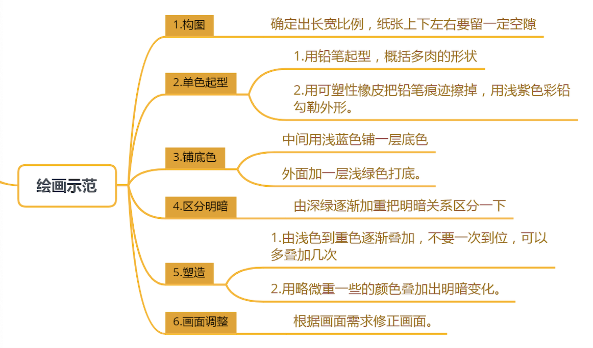
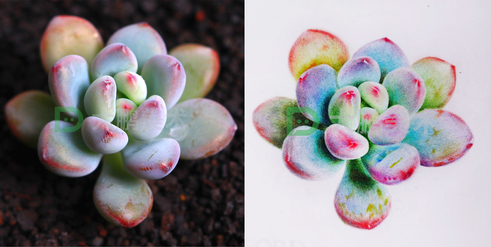
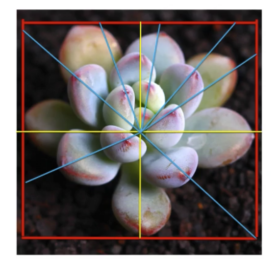
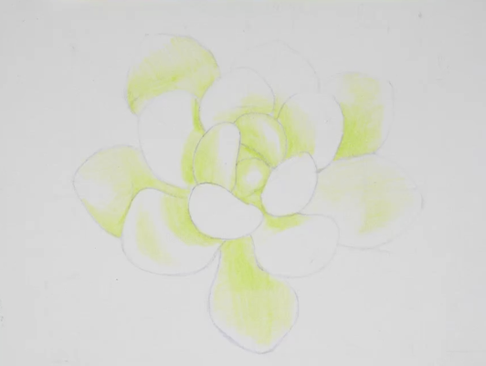
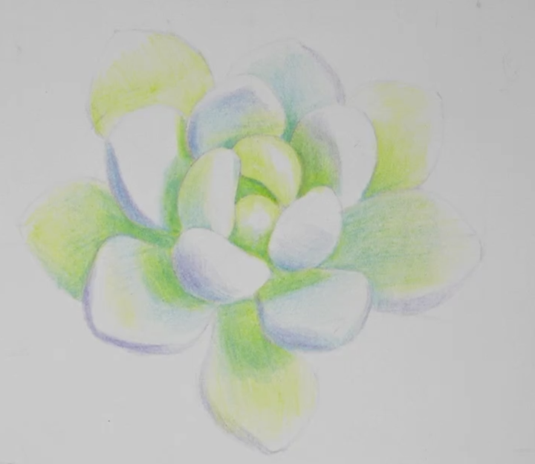
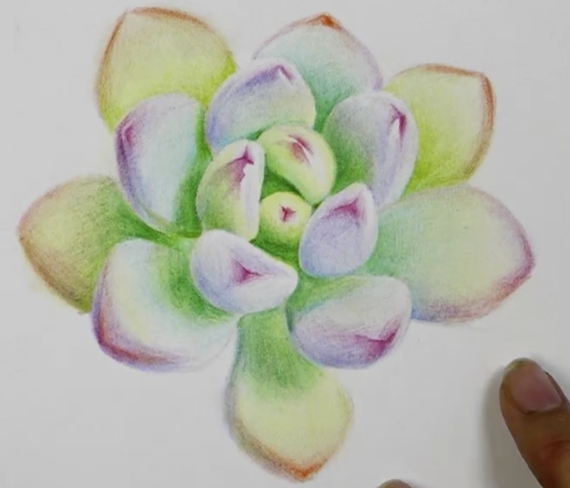

起形---铺色---区分明暗---塑造---调整

##### 辅助线

#### 起形

长方形：画出辅助线

从内往外画

多肉瓣： 先找宽度和厚度的点连接

选色：439勾线

470铺色： 画面中面积最大的颜色，从内向外把偏绿的地方都铺一遍，留出红色的地方

铺绿色454松石蓝多肉阴影出，偏绿的地方

多肉偏紫的部分：439粉紫色

知识点总结：

1. 起形：正方形的中心位置是多肉的中心，从中间向外的瓣越来越大
2. 遮挡关系
3. 底色：颜色并不是单一的，从浅到深叠加投影略重
4. 重点难点：起形起形起形！

现在整个画面偏绿，继续叠加蓝色454松石蓝，从中间往外

 471倾城色继续叠加

画樱桃尖

最嫩的偏粉424

越往外越深 427 打底419 最外围偏暖的地方416

小尖尖：找出三条棱，然后颜色中间最深，越往外越浅

小尖尖和叶片之间的过渡 439

427加强小尖尖

459深绿色加强暗部：阴影

总结：

1. 叠色：仔细观察，学会辨色
2. 虚实变化：从边缘处最深，逐渐过渡
3. 颜色之间的衔接：互相融合，不要出现突兀的色块

#### 塑造和调整

固有色： 470倾城色，454松石蓝，439浅紫色， 加强

阴影加重：459深绿

阴影角落继续加重：441蓝紫

419， 431顶点细节

418加重顶点

409中黄

知识点总结：

1- 过度：不要出现明显的线条，注意虚实变化

2- 明暗：光源方向统一，明暗加强，把暗部投影画出来

3- 塑造： 由浅色到深色叠加，不要一次到位

