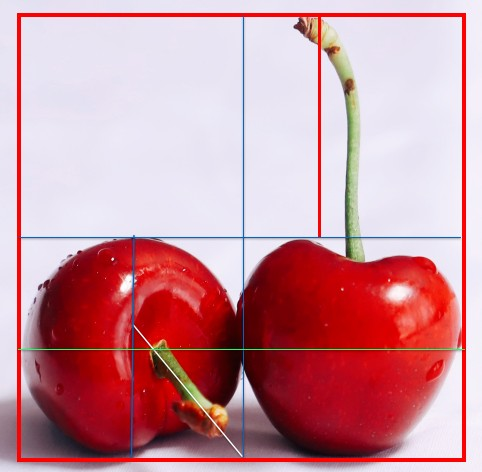

## 构图

樱桃时球体

## 起形

辅助线：正方形， 中轴线

确定樱桃的位置， 确定樱桃梗的位置

起完形，擦掉辅助线，擦浅轮廓线

## 勾线

描边，勾线： 比固有色浅一些 431 470/471 

## 上色

由浅到深：先铺底色，再加强明暗关系：铺底色--416

排线方式：平涂排线 z字形排线 铺底色

​					一般排线 ： 两头轻中间重 塑造 利于衔接

排线方向： 顺着轮廓  顺着边缘线

 铺完底色，区分明暗关系：

通过力度变化

通过叠加

揉擦法： 纸巾

铺樱桃梗： 460 471 先460铺梗再471叠加 小帽子：先407 再416

找重色：梗459 梗头487

画投影： 439+487 揉擦， 加重492

补色：416 补充固有色的饱和度

---------------------------------

上色时需要区分什么颜色： 固有色，光源色，环境色

上色顺序：找出所有看到的颜色，由浅到深去画

## 塑造 + 调整

画面有冷暖：固有色 416

暗部偏冷，选择比固有色更深一点的颜色； 暗部有反光相对亮一点，可以选择439

亮部偏暖，选择比固有色偏暖一点的颜色 409，414

步骤：

1- 樱桃亮部叠加409

2- 樱桃亮部叠加414 亮环中间找重色

3- 樱桃暗部反光处叠加439

挑选暗部颜色： 更红，找出所有的红色，更深的就是紫色，挑出要用的 421 

4- 樱桃暗部用421叠加，右边樱桃画出反光，区分上下部分

5- 樱桃梗， 亮部使用470叠加

6-樱桃梗，暗部使用465叠加 注意亮暗部的过渡

7- 樱桃梗小帽子， 476

8- 右边的梗瘢痕中间用476加重

9-476加重投影

10- 416 继续叠加樱桃，加强饱和度

11-421 继续叠加暗部，加强明暗

12- 428叠加暗部

13- 438 叠加暗部

14- 439 叠加反光， 叠加投影

15- 401叠加投影， 反光，磨皮效果

16- 476 加重投影，499黑色加重

17- 画小水滴：421找位置，电动橡皮，428底部加重，421过渡，点出高光和反光

知识点总结：

1- 不知道叠加什么颜色： 固有色，环境色，光源色

2- 彩铅铺色规律：从浅到深（透气）

3- 色彩的饱和度

4- 暗部：加入邻近色是颜色变重，紫色

5- 反光的边缘虚化，不要太生硬

6- 影子处理：靠近物体最实（颜色最重）， 离物体越远越虚

